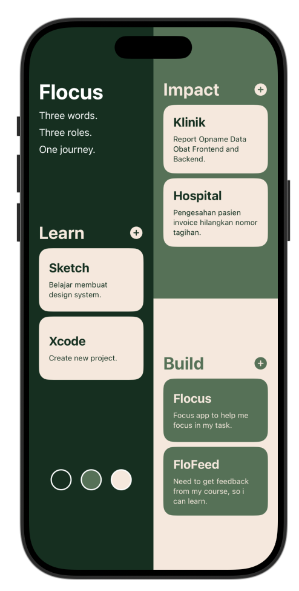

# Flocus

Flocus is a simple SwiftUI application designed to help track progress across three personal growth areas:

* Learn
* Impact
* Build

The app is inspired by the idea that meaningful growth comes from balancing learning, creating impact, and building projects.

> Three words. Three roles. One journey.



---

## Features

### Learn

Track topics, skills, and tools currently being learned.

Examples:

* Sketch
* Xcode

### Impact

Track work, contributions, and activities that create value for others.

Examples:

* Klinik
* Hospital

### Build

Track products, side projects, and ideas being developed.

Examples:

* Flocus
* FloFeed

---

## Progress Tracking

Each item can be marked as completed by tapping the card.

When completed:

* The completion state is updated instantly.
* A checkmark icon appears.
* Progress is reflected in the status section.

---

## Status Overview

The status section displays completion progress for each category.

Example:

Learn   1/2
Impact  2/2
Build   1/2

This provides a quick overview of current progress across all areas.

---

## Architecture

The project follows a component-based SwiftUI structure.

### Main Views

| Component     | Responsibility              |
| ------------- | --------------------------- |
| ContentView   | Main screen composition     |
| HeroSection   | App introduction            |
| LearnSection  | Learning items              |
| ImpactSection | Impact items                |
| BuildSection  | Building/project items      |
| StatusSection | Progress summary            |
| LearnCard     | Interactive task card       |
| StatusBadge   | Category progress indicator |

### Data Model

```swift
struct LearnItem: Identifiable {
    let id: Int
    var title: String
    var description: String
    var isCompleted: Bool
}
```

---

## Technologies

* Swift
* SwiftUI
* State Management using @State
* Data Binding using @Binding

---

## Learning Goals

This project is used to practice:

* SwiftUI fundamentals
* State management
* Component extraction
* Reusable views
* Interactive UI development
* Clean code organization

---

## Future Improvements

### Planned Features

* Add new items
* Edit existing items
* Delete items
* Persist data using SwiftData
* Progress statistics
* Dark mode optimization
* Widget support
* iCloud synchronization

### Technical Debt

* Consolidate LearnSection, ImpactSection, and BuildSection into a reusable RoleSection component
* Introduce ViewModels for better separation of concerns
* Move sample data into a dedicated data source layer

---

## Author

Yuhaya Lissera

Built with SwiftUI as a personal learning and productivity project.
